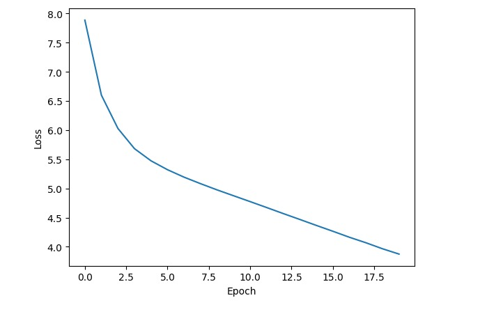

# Transformer Summarizer
Hanf-crafted transformer for text summarization tasks. I implemented the classic encoder-decoder attention mechanism and utilized the transformer to summarize texts. The dataset used to train this small model is taken from DeepLearning.ai's "Natural Language Processing with Attention Models" course. Currently, the loss is as follows:

The plan is to train the model for 100 epochs and then test it on a few examples. The model is trained on a small dataset, so the results may not be as good as the state-of-the-art models. However, the purpose of this project is to understand the transformer architecture and its implementation.
